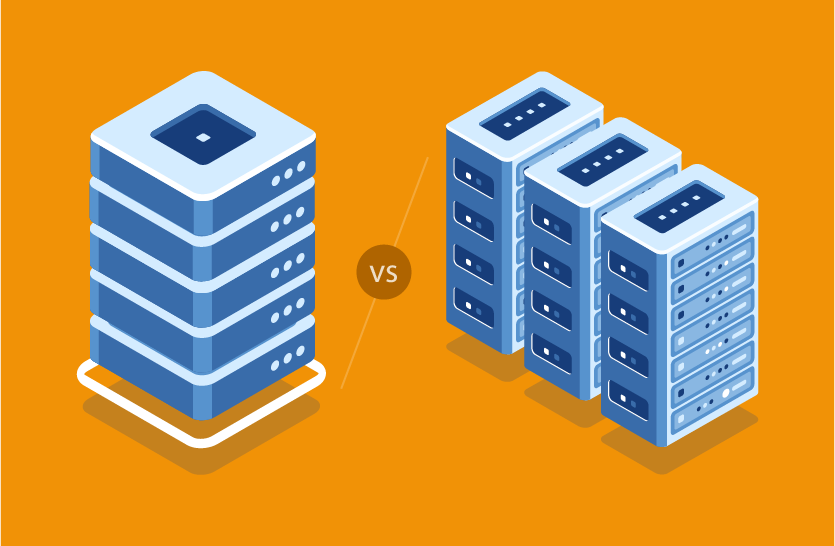
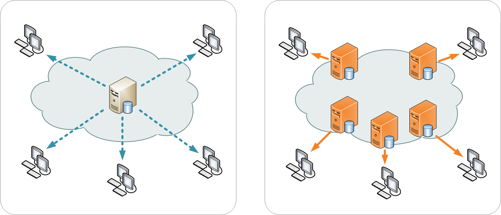

# [2장] 느려진 서비스, 어디부터 봐야 할까

> 주니어 백엔드 개발자가 반드시 알아야 할 실무 지식 — 최범균 저 (한빛미디어, 2025)

---

## 응답 시간 (pp.18~20)

응답 시간은 사용자가 요청을 보내고 결과를 받기까지 걸리는 전체 시간이다. 클라이언트가 서버에 TCP로 연결 → 데이터 전송 → 서버 처리 → 응답 전송, 이 전 과정이 응답 시간에 포함된다.

측정할 때는 TTFB(첫 바이트 도착까지 시간)와 TTLB(마지막 바이트 도착까지 시간)를 구분하는데, 응답 데이터가 작으면 거의 차이가 없다. 파일 다운로드처럼 데이터가 클 때 차이가 벌어진다. 보통 ms(밀리초) 단위를 쓴다.

**핵심: 응답 시간이 사업에 주는 영향**

구글과 아마존의 통계가 인상적이다. 구글은 검색 결과가 400ms만 늦어져도 검색 횟수가 0.6% 줄었고, 아마존은 100ms 느려질 때마다 매출이 1%씩 빠졌다. 더 무서운 건 지연을 복구한 뒤에도 검색 감소세가 한동안 지속됐다는 점이다. 한번 느려져서 떠난 사용자는 쉽게 안 돌아온다.

**핵심: 서버 처리 시간의 실제 비율**

저자가 실제 서비스에서 API 하나의 처리 시간을 측정한 결과:

| 구간 | 시간 | 비율 |
|------|------|------|
| 외부 API 연동 1 (외부 네트워크) | 186ms | 53% |
| DB 연동 (SQL 6회) | 101ms | 29% |
| 내부 API 연동 2 (내부 네트워크) | 44ms | 13% |
| 로직 수행 (if/for 등) | 17ms | 5% |

로직 수행이 5%밖에 안 된다. DB 연동 + API 연동이 95%다. 성능 개선할 때 for문 최적화 같은 거 먼저 보게 되는데, **실제로는 DB 쿼리랑 외부 연동부터 봐야 한다.** API 연동이 없는 서비스라면 DB 연동이 전체의 70~80% 이상을 차지한다.

---

## 처리량 — TPS (pp.21~24)

TPS는 Transaction Per Second, 초당 처리 건수다. RPS(Request Per Second)라고도 하는데 책에서는 TPS를 사용한다.

최대 TPS가 5인 서버에 동시에 7개 요청이 들어오면, 5개는 바로 처리되어 응답이 1초지만 나머지 2개는 대기 1초 + 처리 1초 = 2초가 걸린다. 최대 TPS를 초과하면 이런 식으로 응답 시간이 급격히 늘어난다.

**핵심: TPS를 높이는 2가지 방법**
- 동시에 처리할 수 있는 요청 수를 늘리거나 (서버 추가, 스레드풀 확장)
- 요청 하나를 처리하는 시간 자체를 줄이거나 (쿼리 최적화, 캐시 적용)

성능 개선은 현재 TPS와 응답 시간을 측정하는 것부터 시작해야 한다. "막연히 느리다"면서 이것저것 시도하면 안 된다. 스카우터, 핀포인트, 뉴렐릭 같은 모니터링 도구를 쓰면 실시간 TPS 확인이 가능하고, 없으면 웹 서버 접근 로그를 파싱해서라도 구해야 한다.

---

## 병목 지점 (pp.25~26)

서비스 초기에는 사용자도 적고 데이터도 적어서 성능 문제가 잘 안 생긴다. 트래픽이 늘면서 간헐적으로 느려지기 시작하고, 방치하면 이런 상황이 터진다:
- 순간적으로 모든 요청의 응답이 10초 이상으로 치솟는다
- 서버를 재시작하면 잠시 괜찮다가 다시 느려진다
- 트래픽이 줄어들 때까지 이 상태가 계속된다

원인은 시스템의 최대 TPS를 초과하는 트래픽이 들어오기 때문이다.

**핵심: 병목 찾는 법**

처리 시간이 오래 걸리는 작업을 식별하는 것이 기본이다. 감으로 "이 코드가 느릴 것 같다"고 추측할 수도 있지만, 가능하면 실제 실행 시간을 측정해야 한다. 모니터링 도구가 있으면 실행 시간 추적 기능을 활용하고, 없으면 의심되는 코드의 실행 시간을 **로그로라도 남겨둬야** 나중에 문제가 재발했을 때 원인을 찾을 수 있다.

저자의 경험상 성능 문제는 주로 DB 연동이나 외부 API 연동 과정에서 발생했다고 한다.

---

## 수직 확장과 수평 확장 (pp.26~28)

**수직 확장(Scale-Up)** 은 한 대의 서버에 CPU, 메모리, 디스크 같은 자원을 추가하는 것이다. 클라우드 환경에서 비교적 빠르게 적용 가능해서 급한 불 끄기에 좋다.

저자의 실무 사례: M사 서비스에 장애가 발생했는데 원인이 DB 성능이었다. 쿼리, 테이블 설계 등 여러 면에서 문제가 있었지만 근본적으로 고치려면 시간이 많이 필요했다. 그래서 우선 DB 장비의 CPU를 교체하고 메모리를 증설해서 일단 서비스를 살렸고, 시간을 벌어서 근본 원인을 해결했다. "완전히 중단되는 것보다 다소 느리더라도 서비스를 제공하는 게 낫다"는 판단이었다.

하지만 수직 확장은 비용이 크고 한 대 장비의 한계가 있다. 트래픽이 계속 늘면 결국 **수평 확장(Scale-Out)** 이 필요하다. 서버를 여러 대 늘리고 앞에 로드 밸런서를 두어 트래픽을 분산시킨다.

**핵심: 로드 밸런서**

로드 밸런서가 트래픽을 분배하는 방식은 크게 정적 방식(라운드 로빈 등)과 동적 방식(현재 서버 부하를 보고 판단)으로 나뉜다.

**핵심: DB가 병목인데 서버만 늘리면?**

오히려 더 안 좋아질 수 있다. 서버가 늘어나면 DB에 보내는 쿼리도 더 많아지니까. 병목이 어디인지 먼저 파악하는 게 중요하다.

---

## DB 커넥션 풀 (pp.29~36)

1장에서 개발자 A가 `close()`를 안 해서 커넥션이 누수되어 서비스가 죽은 이야기가 나왔는데, 2장에서 그 원리를 자세히 설명한다.

### 커넥션 풀이 필요한 이유 (pp.29~30)

DB 연결은 비싼 작업이다. TCP 연결 + 인증 + 소켓 오픈 과정을 거치는데, 쿼리 자체는 10ms인데 연결/해제에 100ms가 드는 경우도 있다. 매 요청마다 이걸 반복하면 트래픽이 늘수록 비효율이 심해진다.

커넥션 풀은 서버 시작 시 미리 DB 연결을 여러 개 만들어놓고, 요청이 오면 풀에서 하나 빌려쓰고, 끝나면 끊지 않고 풀에 반환하는 방식이다. Spring Boot에서는 HikariCP가 기본이다.

**핵심: 풀 크기와 TPS 관계**

커넥션 풀 5개, 쿼리 0.1초 → 커넥션 하나가 초당 10개 처리 → 최대 50 TPS.
같은 풀 크기에서 쿼리가 0.5초로 느려지면 → 최대 10 TPS로 급감.

"풀 크기를 그냥 크게 잡으면 되지 않나?" → 아니다. DB CPU가 이미 80%인 상황에서 풀을 늘리면 DB 부하가 더 커져서 쿼리 실행 시간 자체가 늘어난다. 오히려 역효과.

### 커넥션 대기 시간과 fail-fast (pp.31~33)

풀에 여유 커넥션이 없으면 요청은 대기한다. HikariCP 기본 대기 시간이 30초인데, 이게 문제를 키운다. 30초 무응답 → 사용자 새로고침 → 요청 더 쌓임 → 대기 큐 폭발 → 악순환.

**핵심: "무응답보다 빠른 에러가 낫다"**

대기 시간을 짧게 잡아서(1초 등) 커넥션 못 얻으면 빠르게 에러를 반환하는 fail-fast 전략이 서버 부하 측면에서 훨씬 낫다. 사용자 입장에서도 30초 먹통보다 "잠시 후 다시 시도해주세요" 에러가 나은 거다.

### maxLifetime과 idleTimeout (pp.34~36)

MySQL 같은 DBMS는 일정 시간(`wait_timeout`) 동안 쿼리가 없는 커넥션을 자동으로 끊는다. 문제는 커넥션 풀은 그 커넥션이 아직 살아있다고 생각한다는 거다. 이 "죽은 커넥션"으로 쿼리를 보내면 에러가 난다.

**핵심: 반드시 잡아야 할 설정**
- **maxLifetime**: 커넥션 최대 유지 시간. DBMS의 `wait_timeout`보다 짧게 설정. 1장 개발자 A의 두 번째 장애가 바로 이 설정 누락 때문이었다.
- **idleTimeout**: 유휴 커넥션 제거 시간. 새벽처럼 요청이 없을 때 DB가 끊기 전에 풀이 먼저 정리하도록.
- **커넥션 누수**: `close()` 안 하면 커넥션이 풀에 안 돌아온다. 반복되면 풀이 바닥나고 서비스 멈춤.

---

## 캐시 (pp.37~46)

### 서버 캐시 (pp.37~42)

자주 조회되지만 잘 안 변하는 데이터(코드성 데이터, 설정값 등)를 캐시에 넣으면 DB 호출을 크게 줄일 수 있다.

**핵심: 로컬 캐시 vs 외부 캐시**
- **로컬 캐시**: 빠르다. 하지만 서버가 여러 대면 서버 간 데이터 불일치가 생길 수 있다.
- **외부 캐시(Redis 등)**: 서버들이 공유 가능. 대신 네트워크 비용이 추가된다.

**핵심: 캐시 무효화 전략**

캐시에서 가장 중요한 문제. 데이터가 바뀌었는데 캐시에 옛날 값이 남아있으면 사용자에게 잘못된 정보가 간다. 언제, 어떤 조건으로 캐시를 갱신/삭제할지를 반드시 정해야 한다.

**핵심: 캐시 워밍업**

트래픽이 순간적으로 급증하는 패턴이 예측 가능하다면, 급증 전에 미리 캐시를 채워두는 것도 좋은 방법이다. 예를 들어 매일 오전 9시에 트래픽이 몰린다면 8시 50분에 미리 워밍업.

### 정적 자원과 CDN (pp.43~46)

이미지, CSS, JS 같은 정적 파일은 요청마다 서버가 처리할 필요가 없다. HTTP 캐시 헤더(`Cache-Control`, `ETag`)를 설정하면 브라우저가 재요청 자체를 안 한다.

**핵심: CDN이란**

CDN(Content Delivery Network)은 전 세계에 분산된 엣지 서버에 정적 자원을 캐시하는 서비스다. 사용자가 미국 원본 서버까지 안 가고 한국 엣지 서버에서 바로 응답 받을 수 있다. 응답 시간이 줄어들 뿐 아니라 원본 서버 부하도 크게 감소한다.

---

## 대기 처리 (pp.47~49)

이메일 발송, 알림, 로그 기록, 이미지 리사이징처럼 사용자가 즉시 결과를 볼 필요가 없는 작업은 큐에 넣어서 백그라운드에서 처리한다.

**핵심: 응답과 처리를 분리한다**

사용자에게는 "주문 완료" 같은 응답을 먼저 보내고, 이메일 발송은 뒤에서 한다. 이렇게 하면 무거운 작업 때문에 전체 응답이 느려지는 걸 방지할 수 있고, 사용자가 체감하는 응답 시간이 크게 줄어든다.

---

## 느낀점

**측정 먼저, 감 말고 데이터** — 성능 이슈가 생기면 습관적으로 코드 로직부터 의심하게 되는데, 실제로는 로직이 5%밖에 안 차지한다는 실측 데이터를 보고 반성했다. "코드 짜는 시간의 대부분은 로직에 쓰지만, 성능 문제의 대부분은 DB와 네트워크에서 온다" 이 간극을 인식하는 것만으로 접근이 달라질 것 같다.

**급한 불 vs 근본 해결** — M사 사례가 현실적이었다. 완벽한 해결책 찾느라 서비스가 죽어있는 것보다 일단 수직 확장으로 살리고 시간을 버는 게 실무 우선순위라는 걸 느꼈다.

**설정 하나가 서비스를 죽인다** — `close()` 하나 빠뜨리거나 `maxLifetime` 하나 안 잡은 것만으로 전체 서비스가 멈출 수 있다. 프레임워크가 많은 걸 대신 해주지만, 안에서 뭘 해주는지 모르면 문제가 터졌을 때 속수무책이다.
